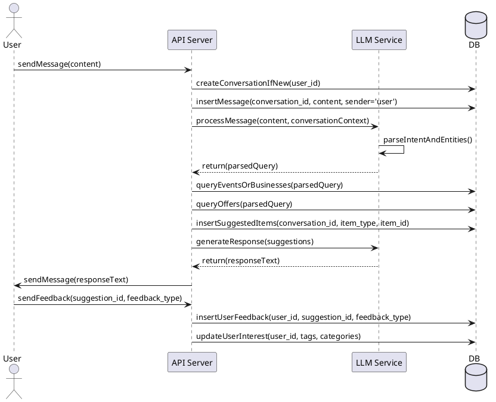

# Discovery Assistant

## Overview

This project implements a conversational discovery assistant for **events, businesses, and offers**. Users can interact via WhatsApp or a web/mobile client. The system uses a **large language model (LLM)** to interpret natural language queries and provide personalized suggestions. Suggestions can include events, businesses, or offers, and users can provide feedback that updates their profile and interest model.

---

## Database Schema

The database supports:

- Users, conversations, and messages
- Events, businesses, offers, and categories
- Tags for flexible filtering
- Suggested items (generic for events, businesses, or offers)
- User feedback and interests

**Highlights:**

- `suggested_item` table is generic and can point to events, businesses, or offers
- `offer` can be tied to a business or an event
- Conversations and messages store chat context for LLM processing
- User feedback influences the recommendation model

---

## API Overview

### 1. Messages

- **Endpoint:** `POST /messages`
- **Description:** Users send messages. The server stores the message, updates conversation context, and forwards the message to the LLM for processing.

### 2. Suggestions

- **Endpoint:** `POST /suggestions`
- **Description:** The system stores suggested items (event, business, offer) for a conversation.

### 3. Feedback

- **Endpoint:** `POST /feedback`
- **Description:** Users provide feedback on suggestions. Updates `user_feedback` and `user_interest` tables.

### 4. Recommendations (Optional)

- **Endpoint:** `GET /recommendations`
- **Description:** Fetch the latest suggestions for a user.

---

## Conversation Workflow

1. **User sends a message** → API receives it.
2. **API creates conversation** if new and logs the message.
3. **API sends message to LLM** for intent parsing and query generation.
4. **LLM returns parsed query** (entities, intent, type of content requested).
5. **API queries database** for events, businesses, and offers based on parsed query.
6. **API stores suggested items** in `suggested_item` table.
7. **API sends suggestions to LLM** to generate response text.
8. **LLM returns response text** → API sends it to the user.
9. **User provides feedback** → API stores feedback and updates user interests.

## Sequence Diagram



# Discovery Assistant — Components and Sequence Flow

This document describes the **main components** of the Discovery Assistant system and how they interact during a conversation, from user message input to recommendation delivery and feedback processing.

It complements the **conversation workflow** and **ERD schema** documentation.

---

## 🎯 System Overview

The Discovery Assistant enables users to discover **events**, **businesses**, and **offers** through conversational interfaces (WhatsApp, web, or mobile).  
It uses:
- a **conversation engine** for context tracking,
- an **LLM processor** for natural language understanding,
- a **recommendation module** for personalized results, and
- a **database** for persistence and feedback learning.

---

## ⚙️ Core Components

### 1. User Interface (Frontend)
**Examples:** WhatsApp chat, Web widget, Mobile app. This MVP will only use Whatsapp chat that will call these apis

**Responsibilities:**
- Captures user input (messages, buttons, feedback).
- Displays responses and suggestions.
- Sends structured data (message text, media, etc.) to the backend API.

**Interactions:**
- Sends user message → `API Gateway`
- Receives assistant message ← `API Gateway`

**Data Handled:**
- User message text
- Message metadata (timestamp, sender)
- Interactive feedback or reactions

---

### 2. API Gateway / Conversation Service
**Examples:** `api/v1/message`, `api/v1/conversation`

**Responsibilities:**
- Entry point for all user messages.
- Creates and maintains **conversation** records.
- Logs messages in the **message** table.
- Sends message + context to the **LLM Processor**.

**Key Functions:**
1. Check if a conversation exists for the user; if not, create one.
2. Insert a new record in `message` with `sender='user'`.
3. Fetch conversation history (context) for the LLM.
4. Call the **LLM Processor** and await results.
5. Store LLM reply and send it back to the user.

**Related Tables:**  
`conversation`, `message`

---

### 3. LLM Processor (AI Engine)
**Responsibilities:**
- Understand user intent and extract structured meaning.
- Generate responses in natural language.
- Summarize conversations for continuity.

**Input:**  
User message + prior conversation context.

**Output:**
- Intent type (event query, business query, offer search, feedback, etc.)
- Extracted parameters (e.g., location, category, date)
- Natural language reply draft.

**Interactions:**
- Calls the **Query Builder / Recommendation Engine** with structured intent.
- Receives structured results (events, businesses, offers).
- Composes final reply.

**Related Tables (indirectly):**  
`user_interest`, `user_feedback`, `suggested_item`, `event`, `business`, `offer`

---

### 4. Query Builder / Recommendation Engine
**Responsibilities:**
- Translates structured intent from the LLM into SQL queries.
- Fetches relevant data (events, businesses, offers).
- Applies personalization filters using `user_interest` and `user_feedback`.

**Examples:**
```sql
SELECT * FROM event WHERE city='Mumbai' AND start_time BETWEEN NOW() AND DATE_ADD(NOW(), INTERVAL 3 DAY);
SELECT * FROM business WHERE city='Mumbai' AND category='Restaurant';
SELECT * FROM offer WHERE (event_id IS NOT NULL OR business_id IS NOT NULL) AND is_active=TRUE;
```